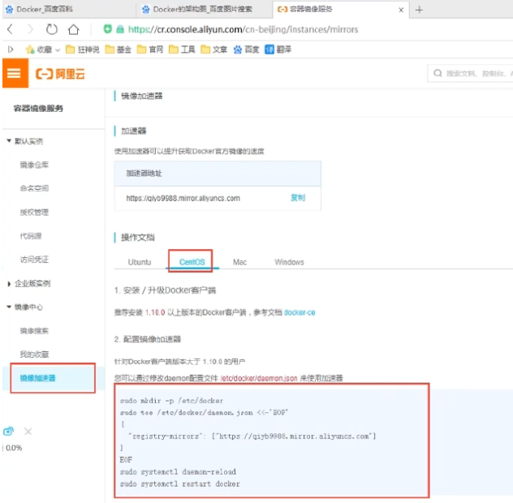
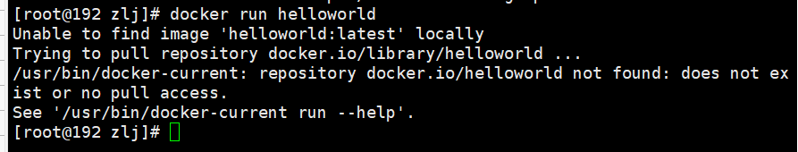
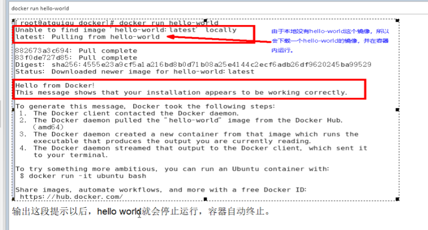
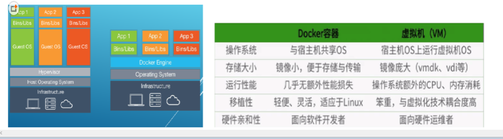
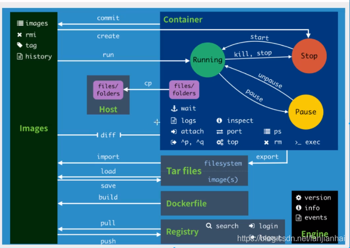
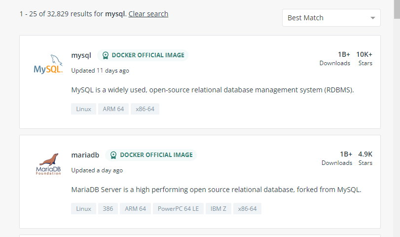

# Docker入门

https://www.bilibili.com/video/BV1og4y1q7M4?spm_id_from=333.999.0.0

狂神说B站视频：https://www.bilibili.com/video/BV1og4y1q7M4?p=1
Docker容器学习笔记二（狂神说Java）：https://blog.csdn.net/qq_41822345/article/details/107123
141
学习docker：https://www.runoob.com/docker/docker-tutorial.html
使用docker：https://labs.play-with-docker.com/


https://note.oddfar.com/docker/  nice

https://blog.csdn.net/qq_21197507/article/details/115071715

## 1 Docker概述

### 1.1 Docker为什么会出现？
一款产品： 开发–上线 两套环境！应用环境，应用配置！
开发 — 运维。 问题：我在我的电脑上可以允许！版本更新，导致服务不可用！对于运维来说考验十分大？
环境配置是十分的麻烦，每一个机器都要部署环境(集群Redis、ES、Hadoop…) !费事费力。
发布一个项目( jar + (Redis MySQL JDK ES) )，项目能不能带上环境安装打包！
之前在服务器配置一个应用的环境 Redis MySQL JDK ES Hadoop 配置超麻烦了，不能够跨平台。
开发环境Windows，最后发布到Linux！
传统：开发jar，运维来做！
现在：开发打包部署上线，一套流程做完！
安卓流程：java — apk —发布（应用商店）一 张三使用apk一安装即可用！
docker流程： java-jar（环境） — 打包项目帯上环境（镜像） — ( Docker仓库：商店）-----Docker给以上的问题，提出了解决方案！

<hr>

**Docker的思想就来自于集装箱！**
JRE – 多个应用(端口冲突) – 原来都是交叉的！

**隔离**：Docker核心思想！打包装箱！每个箱子是互相隔离的。
Docker通过隔离机制，可以将服务器利用到极致！
本质：所有的技术都是因为出现了一些问题，我们需要去解决，才去学习！


### 1.2 Docker的历史

2010年，几个的年轻人，就在美国成立了一家公司 dotcloud
做一些pass的云计算服务！LXC（Linux Container容器）有关的容器技术！

- Linux Container容器是一种内核虚拟化技术，可以提供轻量级的虚拟化，以便隔离进程和资源。

  他们将自己的技术（容器化技术）命名就是 Docker。
  Docker刚刚延生的时候，没有引起行业的注意！dotCloud，就活不下去！

- 开源

  2013年，Docker开源！
  越来越多的人发现docker的优点！火了。Docker每个月都会更新一个版本！
  2014年4月9日，Docker1.0发布！

  docker为什么这么火？十分的轻巧！
  在容器技术出来之前，我们都是使用虚拟机技术！
  虚拟机：在window中装一个VMware，通过这个软件我们可以虚拟出来一台或者多台电脑！笨重！
  虚拟机也属于虚拟化技术，Docker容器技术，也是一种虚拟化技术！

> vm : linux centos 原生镜像（一个电脑！） 隔离、需要开启多个虚拟机！ 几个G 几分钟
> docker: 隔离，镜像（最核心的环境 4m + jdk + mysql）十分的小巧，运行镜像就可以了！小巧！几个MB, 秒级启动！

Docker基于Go语言开发的！开源项目！
docker官网：https://www.docker.com/
文档：https://docs.docker.com/ Docker的文档是超级详细的！
仓库：https://hub.docker.com/


### 1.3 Docker能做什么？

比较Docker和虚拟机技术的不同：

- 传统虚拟机，虚拟出一条硬件，运行一个完整的操作系统，然后在这个系统上安装和运行软件
- 容器内的应用直接运行在宿主机的内容，容器是没有自己的内核的，也没有虚拟我们的硬件，所以就轻便了
- 每个容器间是互相隔离，每个容器内都有一个属于自己的文件系统，互不影响


### 1.4 DevOps(开发、运维)

- 应用更快速的交付和部署

  > 传统：一对帮助文档，安装程序。
  > Docker：打包镜像发布测试一键运行。

- 更便捷的升级和扩缩容

  > 使用了 Docker之后，我们部署应用就和搭 积木一样
  > 项目打包为一个镜像，扩展服务器A！服务器B

- 更简单的系统运维

  > 在容器化之后，我们的开发，测试环境都是高度一致的

- 更高效的计算资源利用

  > Docker是内核级别的虚拟化，可以在一个物理机上可以运行很多的容器实例！服务器的性能可以被压榨到极致。


## 2 Docker安装

### 2.1 Docker的基本组成


- **镜像(image):**

  docker镜像就好比是一个目标，可以通过这个目标来创建容器服务，tomcat镜像=>run=>容器（提供服务器），通过这个镜像可以创建多个容器（最终服务运行或者项目运行就是在容器中的）。

- **容器(container):**

  Docker利用容器技术，独立运行一个或者一组应用，通过镜像来创建的.
  启动，停止，删除，基本命令
  目前就可以把这个容器理解为就是一个简易的 Linux系统。

- **仓库(repository):**

  仓库就是存放镜像的地方！
  仓库分为公有仓库和私有仓库。(很类似git)
  Docker Hub是国外的。
  阿里云…都有容器服务器(配置镜像加速!)


### 2.2 安装Docker

- 环境准备

  Linux要求内核3.0以上

  ```bash
  root@VM-4-2-ubuntu:~# uname -r
  5.4.0-96-generic
  root@VM-4-2-ubuntu:~# cat /etc/os-release
  NAME="Ubuntu"
  VERSION="20.04 LTS (Focal Fossa)"
  ID=ubuntu
  ID_LIKE=debian
  PRETTY_NAME="Ubuntu 20.04 LTS"
  VERSION_ID="20.04"
  HOME_URL="https://www.ubuntu.com/"
  SUPPORT_URL="https://help.ubuntu.com/"
  BUG_REPORT_URL="https://bugs.launchpad.net/ubuntu/"
  PRIVACY_POLICY_URL="https://www.ubuntu.com/legal/terms-and-policies/privacy-policy"
  VERSION_CODENAME=focal
  UBUNTU_CODENAME=focal
  ```

- 安装

  ```bash
  帮助文档：https://docs.docker.com/engine/install/
  Ubuntu Docker的安装：https://www.runoob.com/docker/ubuntu-docker-install.html
  ```

  ```bash
  这是Centos的安装命令
  #1.卸载旧版本
  yum remove docker \
              docker-client \
              docker-client-latest \
              docker-common \
              docker-latest \
              docker-latest-logrotate \
              docker-logrotate \
              docker-engine
  
  #2.需要的安装包
  yum install -y yum-utils
  
  #3.设置镜像的仓库
  yum-config-manager \
  		--add-repo \
  		https://download.docker.com/linux/centos/docker-ce.repo
  #默认是从国外的，不推荐
  #推荐使用国内的
  yum-config-manager \
          --add-repo \
          https://mirrors.aliyun.com/docker-ce/linux/centos/docker-ce.repo
  
  #更新yum软件包索引
  yum makecache fast
  
  #4.安装docker相关的 docker-ce 社区版 而ee是企业版
  yum install docker-ce docker-ce-cli containerd.io
  
  #6. 使用docker version查看是否按照成功
  docker version
  
  #7. 测试
  docker run hello-world
  ```

  ```bash
  #7. 测试
  ➜ ~ docker run hello-world
  Hello from Docker!
  This message shows that your installation appears to be working correctly.
  To generate this message, Docker took the following steps:
  1. The Docker client contacted the Docker daemon.
  2. The Docker daemon pulled the "hello-world" image from the Docker Hub.
  (amd64)
  3. The Docker daemon created a new container from that image which runs the
  executable that produces the output you are currently reading.
  4. The Docker daemon streamed that output to the Docker client, which sent it
  to your terminal.
  To try something more ambitious, you can run an Ubuntu container with:
  $ docker run -it ubuntu bash
  Share images, automate workflows, and more with a free Docker ID:
  https://hub.docker.com/
  For more examples and ideas, visit:
  https://docs.docker.com/get-started/
  
  #8.查看一下下载的镜像
  ➜ ~ docker images
  REPOSITORY TAG IMAGE ID CREATED SIZE
  hello-world latest bf756fb1ae65 4 months ago 13.3kB
  ```

  了解：卸载docker

  ```bash
  #1. 卸载依赖
  yum remove docker-ce docker-ce-cli containerd.io
  #2. 删除资源
  rm -rf /var/lib/docker
  # /var/lib/docker 是docker的默认工作路径！
  ```

  

### 2.3 阿里云镜像加速

1、登录阿里云找到容器服务
2、找到镜像加速器

而腾讯云是这样的https://cloud.tencent.com/document/product/1207/45596




### 2.4 底层原理

就拿Hello-world镜像举例






> 底层原理

Docker Engine是一个客户端-服务器应用程序，具有以下主要组件:

- 一个服务器，它是一种长期运行的程序，称为守护进程(dockerd命令)
- 一个REST API，它指定程序可以用来与守护进程对话并指示它做什么的接口。

Docker是一个**Client Server结构的系统**，Docker守护进程运行在主机上，然后通过Socket连接从客户 端访问，守护进程从客户端接受命令并管理运行在主机上的容器。**容器，是一个运行时环境就是我们所说的集装箱。**


> 为啥Docker比VM虚拟机快

- docker有着比虚拟机更少的抽象层。由于docker不需要Hypervisor实现硬件资源虚拟化,*运行在docker容器上的程序直接使用的都是实际物理机的硬件资源*。因此在CPU、内存利用率上docker将会在效率上有明显优势。

- **docker利用的是宿主机的内核,而不需要Guest OS**。因此,当新建一个 容器时,docker不需要和虚拟机一样重新加载一个操作系统内核。仍而避免引寻、加载操作系统内核返个比较费时费资源的过程,当新建一个虚拟机时,虚拟机软件需要加载GuestOS,返个新建过程是分钟级别的。而docker由于直接利用宿主机的操作系统,则省略了返个过程,因此新建一个docker容器只需要几秒钟。

  

  


## 3 Docker基本命令

### 3.1 Docker常用命令



> 帮助命令

```bash
docker version  # docker版本信息
docker info     # 系统级别的信息，包括镜像和容器的数量
docker 命令 --help 
```

官方命令文档：https://docs.docker.com/engine/reference/commandline/docker/

> 镜像命令

- `docker images`查看本地主机上所有的镜像

  ```bash
  [root@iZ2zeg4ytp0whqtmxbsqiiZ ~]# docker images
  REPOSITORY          TAG                 IMAGE ID            CREATED             SIZE
  hello-world         latest              bf756fb1ae65        7 months ago        13.3kB
   
  # 解释
  REPOSITORY      # 镜像的仓库
  TAG             # 镜像的标签
  IMAGE ID        # 镜像的ID
  CREATED         # 镜像的创建时间
  SIZE            # 镜像的大小
   
  # 可选项
  --all , -a      # 列出所有镜像
  --quiet , -q    # 只显示镜像的id
  ```

- `docker search` 查找镜像

  可以直接在网页上查找镜像https://hub.docker.com/search?q=mysql ， 也可以使用命令行

  

  ```bash
  root@VM-4-2-ubuntu:~# docker search mysql
  NAME                              DESCRIPTION                                     STARS               OFFICIAL         AUTOMATED
  mysql                             MySQL is a widely used, open-source relation…   9822                [OK]                
  mariadb                           MariaDB is a community-developed fork of MyS…   3586                [OK]                
  mysql/mysql-server                Optimized MySQL Server Docker images. Create…   719                                     [OK]
   
  # 可选项
  --filter=STARS=3000     # 搜索出来的镜像就是STARS大于3000的
   
  [root@iZ2zeg4ytp0whqtmxbsqiiZ ~]# docker search mysql --filter=STARS=3000
  NAME                DESCRIPTION                                     STARS               OFFICIAL            AUTOMATED
  mysql               MySQL is a widely used, open-source relation…   9822                [OK]                
  mariadb             MariaDB is a community-developed fork of MyS…   3586                [OK]     
  ```

- `docker pull`拉取镜像

  ```bash
  # 下载镜像，docker pull 镜像名[:tag]
  [root@iZ2zeg4ytp0whqtmxbsqiiZ ~]# docker pull mysql
  Using default tag: latest           # 如果不写tag，默认就是latest
  latest: Pulling from library/mysql
  bf5952930446: Pull complete         # 分层下载，dockerimages的核心，联合文件系统
  8254623a9871: Pull complete 
  938e3e06dac4: Pull complete 
  ea28ebf28884: Pull complete 
  f3cef38785c2: Pull complete 
  894f9792565a: Pull complete 
  1d8a57523420: Pull complete 
  6c676912929f: Pull complete 
  ff39fdb566b4: Pull complete 
  fff872988aba: Pull complete 
  4d34e365ae68: Pull complete 
  7886ee20621e: Pull complete 
  Digest: sha256:c358e72e100ab493a0304bda35e6f239db2ec8c9bb836d8a427ac34307d074ed     # 签名
  Status: Downloaded newer image for mysql:latest
  docker.io/library/mysql:latest      # 真实地址
   
  # 等价于
  docker pull mysql == docker pull docker.io/library/mysql:latest
   
  # 指定版本下载,但版本必须要是官网有的
  [root@iZ2zeg4ytp0whqtmxbsqiiZ ~]# docker pull mysql:5.7
  5.7: Pulling from library/mysql
  bf5952930446: Already exists 
  8254623a9871: Already exists 
  938e3e06dac4: Already exists 
  ea28ebf28884: Already exists 
  f3cef38785c2: Already exists 
  894f9792565a: Already exists 
  1d8a57523420: Already exists 
  5f09bf1d31c1: Pull complete 
  1b6ff254abe7: Pull complete 
  74310a0bf42d: Pull complete 
  d398726627fd: Pull complete 
  Digest: sha256:da58f943b94721d46e87d5de208dc07302a8b13e638cd1d24285d222376d6d84
  Status: Downloaded newer image for mysql:5.7
  docker.io/library/mysql:5.7
   
  # 查看本地镜像
  [root@iZ2zeg4ytp0whqtmxbsqiiZ ~]# docker images
  REPOSITORY          TAG                 IMAGE ID            CREATED             SIZE
  mysql               5.7                 718a6da099d8        6 days ago          448MB
  mysql               latest              0d64f46acfd1        6 days ago          544MB
  hello-world         latest              bf756fb1ae65        7 months ago        13.3kB
  ```

- `docker rmi`删除镜像

  ```bash
  [root@iZ2zeg4ytp0whqtmxbsqiiZ ~]# docker rmi -f IMAGE_ID                        # 删除指定镜像
  [root@iZ2zeg4ytp0whqtmxbsqiiZ ~]# docker rmi -f IMAGE_ID1 IMAGE_ID2 IMAGE_ID3   # 删除多个镜像
  [root@iZ2zeg4ytp0whqtmxbsqiiZ ~]#  docker rmi -f $(docker images -aq)           # 删除所有镜像
  ```

  

