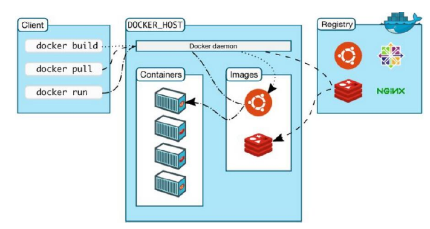
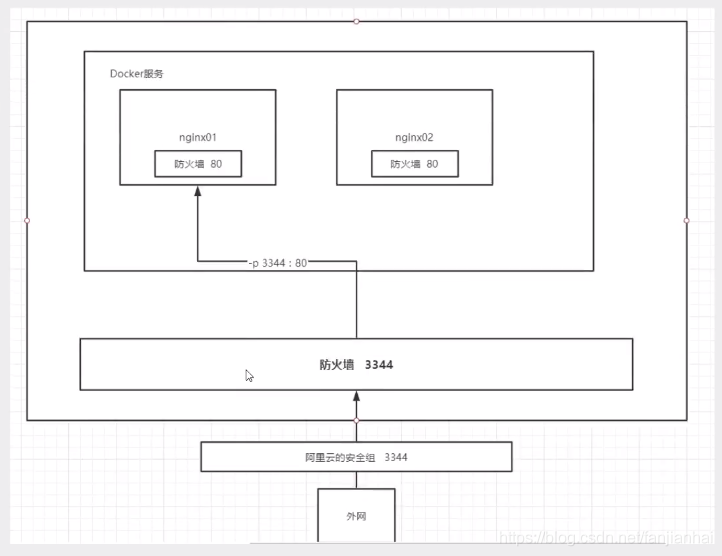
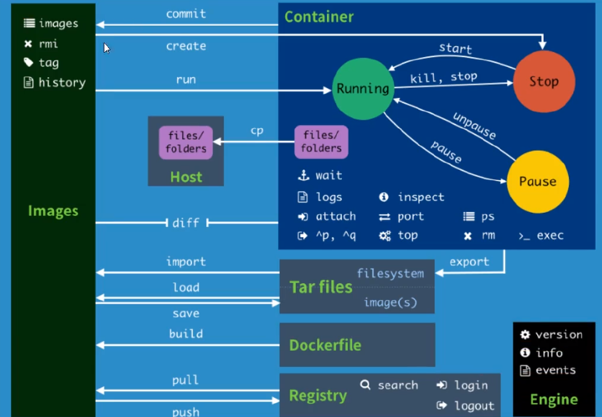

# Docker入门

https://www.bilibili.com/video/BV1og4y1q7M4?spm_id_from=333.999.0.0

狂神说B站视频：https://www.bilibili.com/video/BV1og4y1q7M4?p=1
Docker容器学习笔记二（狂神说Java）：https://blog.csdn.net/qq_41822345/article/details/107123
141
学习docker：https://www.runoob.com/docker/docker-tutorial.html
使用docker：https://labs.play-with-docker.com/


https://note.oddfar.com/docker/  nice

https://blog.csdn.net/qq_41822345/article/details/107123094 笔记上篇

https://blog.csdn.net/qq_41822345/article/details/107123141 笔记下篇

## 1 Docker概述

### 1.1 Docker为什么会出现？
一款产品： 开发–上线 两套环境！应用环境，应用配置！
开发 — 运维。 问题：我在我的电脑上可以允许！版本更新，导致服务不可用！对于运维来说考验十分大？
环境配置是十分的麻烦，每一个机器都要部署环境(集群Redis、ES、Hadoop…) !费事费力。
发布一个项目( jar + (Redis MySQL JDK ES) )，项目能不能带上环境安装打包！
之前在服务器配置一个应用的环境 Redis MySQL JDK ES Hadoop 配置超麻烦了，不能够跨平台。
开发环境Windows，最后发布到Linux！
传统：开发jar，运维来做！
现在：开发打包部署上线，一套流程做完！
安卓流程：java — apk —发布（应用商店）一 张三使用apk一安装即可用！
docker流程： java-jar（环境） — 打包项目帯上环境（镜像） — ( Docker仓库：商店）-----Docker给以上的问题，提出了解决方案！

<hr>

**Docker的思想就来自于集装箱！**
JRE – 多个应用(端口冲突) – 原来都是交叉的！

**隔离**：Docker核心思想！打包装箱！每个箱子是互相隔离的。
Docker通过隔离机制，可以将服务器利用到极致！
本质：所有的技术都是因为出现了一些问题，我们需要去解决，才去学习！


### 1.2 Docker的历史

2010年，几个的年轻人，就在美国成立了一家公司 dotcloud
做一些pass的云计算服务！LXC（Linux Container容器）有关的容器技术！

- Linux Container容器是一种内核虚拟化技术，可以提供轻量级的虚拟化，以便隔离进程和资源。

  他们将自己的技术（容器化技术）命名就是 Docker。
  Docker刚刚延生的时候，没有引起行业的注意！dotCloud，就活不下去！

- 开源

  2013年，Docker开源！
  越来越多的人发现docker的优点！火了。Docker每个月都会更新一个版本！
  2014年4月9日，Docker1.0发布！

  docker为什么这么火？十分的轻巧！
  在容器技术出来之前，我们都是使用虚拟机技术！
  虚拟机：在window中装一个VMware，通过这个软件我们可以虚拟出来一台或者多台电脑！笨重！
  虚拟机也属于虚拟化技术，Docker容器技术，也是一种虚拟化技术！

> vm : linux centos 原生镜像（一个电脑！） 隔离、需要开启多个虚拟机！ 几个G 几分钟
> docker: 隔离，镜像（最核心的环境 4m + jdk + mysql）十分的小巧，运行镜像就可以了！小巧！几个MB, 秒级启动！

Docker基于Go语言开发的！开源项目！
docker官网：https://www.docker.com/
文档：https://docs.docker.com/ Docker的文档是超级详细的！
仓库：https://hub.docker.com/


### 1.3 Docker能做什么？

比较Docker和虚拟机技术的不同：

- 传统虚拟机，虚拟出一条硬件，运行一个完整的操作系统，然后在这个系统上安装和运行软件
- 容器内的应用直接运行在宿主机的内容，容器是没有自己的内核的，也没有虚拟我们的硬件，所以就轻便了
- 每个容器间是互相隔离，每个容器内都有一个属于自己的文件系统，互不影响


### 1.4 DevOps(开发、运维)

- 应用更快速的交付和部署

  > 传统：一对帮助文档，安装程序。
  > Docker：打包镜像发布测试一键运行。

- 更便捷的升级和扩缩容

  > 使用了 Docker之后，我们部署应用就和搭 积木一样
  > 项目打包为一个镜像，扩展服务器A！服务器B

- 更简单的系统运维

  > 在容器化之后，我们的开发，测试环境都是高度一致的

- 更高效的计算资源利用

  > Docker是内核级别的虚拟化，可以在一个物理机上可以运行很多的容器实例！服务器的性能可以被压榨到极致。


## 2 Docker安装

### 2.1 Docker的基本组成



- **镜像(image):**

  docker镜像就好比是一个目标，可以通过这个目标来创建容器服务，tomcat镜像=>run=>容器（提供服务器），通过这个镜像可以创建多个容器（最终服务运行或者项目运行就是在容器中的）。

- **容器(container):**

  Docker利用容器技术，独立运行一个或者一组应用，通过镜像来创建的.
  启动，停止，删除，基本命令
  目前就可以把这个容器理解为就是一个简易的 Linux系统。

- **仓库(repository):**

  仓库就是存放镜像的地方！
  仓库分为公有仓库和私有仓库。(很类似git)
  Docker Hub是国外的。
  阿里云…都有容器服务器(配置镜像加速!)


### 2.2 安装Docker

- 环境准备

  Linux要求内核3.0以上

  ```bash
  root@VM-4-2-ubuntu:~# uname -r
  5.4.0-96-generic
  root@VM-4-2-ubuntu:~# cat /etc/os-release
  NAME="Ubuntu"
  VERSION="20.04 LTS (Focal Fossa)"
  ID=ubuntu
  ID_LIKE=debian
  PRETTY_NAME="Ubuntu 20.04 LTS"
  VERSION_ID="20.04"
  HOME_URL="https://www.ubuntu.com/"
  SUPPORT_URL="https://help.ubuntu.com/"
  BUG_REPORT_URL="https://bugs.launchpad.net/ubuntu/"
  PRIVACY_POLICY_URL="https://www.ubuntu.com/legal/terms-and-policies/privacy-policy"
  VERSION_CODENAME=focal
  UBUNTU_CODENAME=focal
  ```

- 安装

  ```bash
  帮助文档：https://docs.docker.com/engine/install/
  Ubuntu Docker的安装：https://www.runoob.com/docker/ubuntu-docker-install.html
  ```

  ```bash
  这是Centos的安装命令
  #1.卸载旧版本
  yum remove docker \
              docker-client \
              docker-client-latest \
              docker-common \
              docker-latest \
              docker-latest-logrotate \
              docker-logrotate \
              docker-engine
  
  #2.需要的安装包
  yum install -y yum-utils
  
  #3.设置镜像的仓库
  yum-config-manager \
  		--add-repo \
  		https://download.docker.com/linux/centos/docker-ce.repo
  #默认是从国外的，不推荐
  #推荐使用国内的
  yum-config-manager \
          --add-repo \
          https://mirrors.aliyun.com/docker-ce/linux/centos/docker-ce.repo
  
  #更新yum软件包索引
  yum makecache fast
  
  #4.安装docker相关的 docker-ce 社区版 而ee是企业版
  yum install docker-ce docker-ce-cli containerd.io
  
  #6. 使用docker version查看是否按照成功
  docker version
  
  #7. 测试
  docker run hello-world
  ```

  ```bash
  #7. 测试
  ➜ ~ docker run hello-world
  Hello from Docker!
  This message shows that your installation appears to be working correctly.
  To generate this message, Docker took the following steps:
  1. The Docker client contacted the Docker daemon.
  2. The Docker daemon pulled the "hello-world" image from the Docker Hub.
  (amd64)
  3. The Docker daemon created a new container from that image which runs the
  executable that produces the output you are currently reading.
  4. The Docker daemon streamed that output to the Docker client, which sent it
  to your terminal.
  To try something more ambitious, you can run an Ubuntu container with:
  $ docker run -it ubuntu bash
  Share images, automate workflows, and more with a free Docker ID:
  https://hub.docker.com/
  For more examples and ideas, visit:
  https://docs.docker.com/get-started/
  
  #8.查看一下下载的镜像
  ➜ ~ docker images
  REPOSITORY TAG IMAGE ID CREATED SIZE
  hello-world latest bf756fb1ae65 4 months ago 13.3kB
  ```

  了解：卸载docker

  ```bash
  #1. 卸载依赖
  yum remove docker-ce docker-ce-cli containerd.io
  #2. 删除资源
  rm -rf /var/lib/docker
  # /var/lib/docker 是docker的默认工作路径！
  ```

  

### 2.3 阿里云镜像加速

1、登录阿里云找到容器服务
2、找到镜像加速器

而腾讯云是这样的https://cloud.tencent.com/document/product/1207/45596


### 2.4 底层原理

就拿Hello-world镜像举例


> 底层原理

Docker Engine是一个客户端-服务器应用程序，具有以下主要组件:

- 一个服务器，它是一种长期运行的程序，称为守护进程(dockerd命令)
- 一个REST API，它指定程序可以用来与守护进程对话并指示它做什么的接口。

Docker是一个**Client Server结构的系统**，Docker守护进程运行在主机上，然后通过Socket连接从客户 端访问，守护进程从客户端接受命令并管理运行在主机上的容器。**容器，是一个运行时环境就是我们所说的集装箱。**


> 为啥Docker比VM虚拟机快

- docker有着比虚拟机更少的抽象层。由于docker不需要Hypervisor实现硬件资源虚拟化,*运行在docker容器上的程序直接使用的都是实际物理机的硬件资源*。因此在CPU、内存利用率上docker将会在效率上有明显优势。

- **docker利用的是宿主机的内核,而不需要Guest OS**。因此,当新建一个 容器时,docker不需要和虚拟机一样重新加载一个操作系统内核。仍而避免引寻、加载操作系统内核返个比较费时费资源的过程,当新建一个虚拟机时,虚拟机软件需要加载GuestOS,返个新建过程是分钟级别的。而docker由于直接利用宿主机的操作系统,则省略了返个过程,因此新建一个docker容器只需要几秒钟。

  

  


## 3 Docker基本命令

### 3.1 Docker常用命令



#### 3.1.1 帮助命令

```bash
docker version  # docker版本信息
docker info     # 系统级别的信息，包括镜像和容器的数量
docker 命令 --help 
```

官方命令文档：https://docs.docker.com/engine/reference/commandline/docker/


#### 3.1.2 镜像命令

- `docker images`查看本地主机上所有的镜像

  ```bash
  [root@iZ2zeg4ytp0whqtmxbsqiiZ ~]# docker images
  REPOSITORY          TAG                 IMAGE ID            CREATED             SIZE
  hello-world         latest              bf756fb1ae65        7 months ago        13.3kB
   
  # 解释
  REPOSITORY      # 镜像的仓库
  TAG             # 镜像的标签
  IMAGE ID        # 镜像的ID
  CREATED         # 镜像的创建时间
  SIZE            # 镜像的大小
   
  # 可选项
  --all , -a      # 列出所有镜像
  --quiet , -q    # 只显示镜像的id
  ```

- `docker search` 查找镜像

  可以直接在网页上查找镜像https://hub.docker.com/search?q=mysql ， 也可以使用命令行

  

  ```bash
  root@VM-4-2-ubuntu:~# docker search mysql
  NAME                              DESCRIPTION                                     STARS               OFFICIAL         AUTOMATED
  mysql                             MySQL is a widely used, open-source relation…   9822                [OK]                
  mariadb                           MariaDB is a community-developed fork of MyS…   3586                [OK]                
  mysql/mysql-server                Optimized MySQL Server Docker images. Create…   719                                     [OK]
   
  # 可选项
  --filter=STARS=3000     # 搜索出来的镜像就是STARS大于3000的
   
  [root@iZ2zeg4ytp0whqtmxbsqiiZ ~]# docker search mysql --filter=STARS=3000
  NAME                DESCRIPTION                                     STARS               OFFICIAL            AUTOMATED
  mysql               MySQL is a widely used, open-source relation…   9822                [OK]                
  mariadb             MariaDB is a community-developed fork of MyS…   3586                [OK]     
  ```

- `docker pull`拉取镜像

  ```bash
  # 下载镜像，docker pull 镜像名[:tag]
  [root@iZ2zeg4ytp0whqtmxbsqiiZ ~]# docker pull mysql
  Using default tag: latest           # 如果不写tag，默认就是latest
  latest: Pulling from library/mysql
  bf5952930446: Pull complete         # 分层下载，dockerimages的核心，联合文件系统
  8254623a9871: Pull complete 
  938e3e06dac4: Pull complete 
  ea28ebf28884: Pull complete 
  f3cef38785c2: Pull complete 
  894f9792565a: Pull complete 
  1d8a57523420: Pull complete 
  6c676912929f: Pull complete 
  ff39fdb566b4: Pull complete 
  fff872988aba: Pull complete 
  4d34e365ae68: Pull complete 
  7886ee20621e: Pull complete 
  Digest: sha256:c358e72e100ab493a0304bda35e6f239db2ec8c9bb836d8a427ac34307d074ed     # 签名
  Status: Downloaded newer image for mysql:latest
  docker.io/library/mysql:latest      # 真实地址
   
  # 等价于
  docker pull mysql == docker pull docker.io/library/mysql:latest
   
  # 指定版本下载,但版本必须要是官网有的
  [root@iZ2zeg4ytp0whqtmxbsqiiZ ~]# docker pull mysql:5.7
  5.7: Pulling from library/mysql
  bf5952930446: Already exists 
  8254623a9871: Already exists 
  938e3e06dac4: Already exists 
  ea28ebf28884: Already exists 
  f3cef38785c2: Already exists 
  894f9792565a: Already exists 
  1d8a57523420: Already exists 
  5f09bf1d31c1: Pull complete 
  1b6ff254abe7: Pull complete 
  74310a0bf42d: Pull complete 
  d398726627fd: Pull complete 
  Digest: sha256:da58f943b94721d46e87d5de208dc07302a8b13e638cd1d24285d222376d6d84
  Status: Downloaded newer image for mysql:5.7
  docker.io/library/mysql:5.7
   
  # 查看本地镜像
  [root@iZ2zeg4ytp0whqtmxbsqiiZ ~]# docker images
  REPOSITORY          TAG                 IMAGE ID            CREATED             SIZE
  mysql               5.7                 718a6da099d8        6 days ago          448MB
  mysql               latest              0d64f46acfd1        6 days ago          544MB
  hello-world         latest              bf756fb1ae65        7 months ago        13.3kB
  ```

- `docker rmi`删除镜像

  ```bash
  [root@iZ2zeg4ytp0whqtmxbsqiiZ ~]# docker rmi -f IMAGE_ID                        # 删除指定镜像
  [root@iZ2zeg4ytp0whqtmxbsqiiZ ~]# docker rmi -f IMAGE_ID1 IMAGE_ID2 IMAGE_ID3   # 删除多个镜像
  [root@iZ2zeg4ytp0whqtmxbsqiiZ ~]#  docker rmi -f $(docker images -aq)           # 删除所有镜像
  ```

  

#### 3.1.3 容器命令

**说明： 我们有了镜像才可创建容器，linux，下载一个centos镜像来测试学习**

```shell
docker pull centos
```

- 新建容器并启动

  ```bash
  docker run [可选参数] [imageName]
   
  # 参数说明
  --name=“Name”   给容器命名    tomcat01    tomcat02    用来区分容器
  -d      后台方式运行
  -it     使用交互方式运行，进入容器查看内容
  -p      指定容器的端口     -p 8080:8080
      -p  ip:主机端口：容器端口
      -p  主机端口：容器端口（常用）
      -p  容器端口(只有主机内才能访问了)
      容器端口(也可以不加-p，等同于上一条)
  -P      随机指定端口
   
   
  # 测试，启动并进入容器，/bin/bash表示以什么什么命令方式进入，还可以些/bin/sh
  [root@iZ2zeg4ytp0whqtmxbsqiiZ ~]# docker run -it centos /bin/bash
  [root@74e82b7980e7 /]# ls   # 查看容器内的centos，基础版本，很多命令是不完善的
  bin  etc   lib    lost+found  mnt  proc  run   srv  tmp  var
  dev  home  lib64  media       opt  root  sbin  sys  usr
   
  # 从容器中退回主机
  [root@77969f5dcbf9 /]# exit
  exit
  [root@iZ2zeg4ytp0whqtmxbsqiiZ /]# ls
  bin   dev  fanfan  lib    lost+found  mnt  proc  run   srv  tmp  var
  boot  etc  home    lib64  media       opt  root  sbin  sys  usr
  ```

- 列出所有运行的容器

  ```bash
  # docker ps 命令
  无       # 列出当前正在运行的容器
  -a      # 列出正在运行的容器包括历史容器
  -n=?    # 显示最近创建的容器
  -q      # 只显示当前容器的编号
   
  [root@iZ2zeg4ytp0whqtmxbsqiiZ /]# docker ps
  CONTAINER ID        IMAGE               COMMAND             CREATED             STATUS              PORTS               NAMES
  [root@iZ2zeg4ytp0whqtmxbsqiiZ /]# docker ps -a
  CONTAINER ID        IMAGE               COMMAND             CREATED             STATUS                     PORTS               NAMES
  77969f5dcbf9        centos              "/bin/bash"         5 minutes ago       Exited (0) 5 minutes ago                       xenodochial_bose
  74e82b7980e7        centos              "/bin/bash"         16 minutes ago      Exited (0) 6 minutes ago                       silly_cori
  a57250395804        bf756fb1ae65        "/hello"            7 hours ago         Exited (0) 7 hours ago                         elated_nash
  392d674f4f18        bf756fb1ae65        "/hello"            8 hours ago         Exited (0) 8 hours ago                         distracted_mcnulty
  571d1bc0e8e8        bf756fb1ae65        "/hello"            23 hours ago        Exited (0) 23 hours ago                        magical_burnell
   
  [root@iZ2zeg4ytp0whqtmxbsqiiZ /]# docker ps -qa
  77969f5dcbf9
  74e82b7980e7
  a57250395804
  392d674f4f18
  571d1bc0e8e8
  ```

- 退出容器

  ```bash
  exit            # 直接退出容器并关闭
  Ctrl + P + Q    # 容器不关闭退出，就想nohup java -jar
  ```

- 删除容器

  ```bash
  docker rm -f 容器id                  # 删除指定容器
  docker rm -f $(docker ps -aq)       # 删除所有容器
  docker ps -a -q|xargs docker rm -f  # 删除所有的容器
  ```

- 启动和停止容器

  ```bash
  docker start 容器id           # 启动容器
  docker restart 容器id         # 重启容器
  docker stop 容器id            # 停止当前正在运行的容器
  docker kill 容器id            # 强制停止当前的容器
  ```


#### 3.1.4 常用其他命令

- 后台启动容器

  ```bash
  # 命令 docker run -d 镜像名
  [root@iZ2zeg4ytp0whqtmxbsqiiZ /]# docker run -d centos
   
  # 问题 docker ps， 发现centos停止了
   
  # 常见的坑， docker 容器使用后台运行， 就必须要有一个前台进程，docker发现没有应用，就会自动停止
  # 如同nginx， 容器启动后，发现自己没有提供服务，就会立即停止，就是没有程序了
  ```

- 查看日志

  ```bash
  docker logs -tf --tail number 容器id
   
  [root@iZ2zeg4ytp0whqtmxbsqiiZ /]# docker logs -tf --tail 1 8d1621e09bff
  2020-08-11T10:53:15.987702897Z [root@8d1621e09bff /]# exit      # 日志输出
   
  # 自己编写一段shell脚本
  [root@iZ2zeg4ytp0whqtmxbsqiiZ /]# docker run -d centos /bin/sh -c "while true;do echo message;sleep 1;done"
  a0d580a21251da97bc050763cf2d5692a455c228fa2a711c3609872008e654c2
   
  [root@iZ2zeg4ytp0whqtmxbsqiiZ /]# docker ps
  CONTAINER ID        IMAGE               COMMAND                  CREATED             STATUS              PORTS               NAMES
  a0d580a21251        centos              "/bin/sh -c 'while t…"   3 seconds ago       Up 1 second                             lucid_black
   
  # 显示日志
  -tf                 # 显示日志,t打印时间戳，f持续输出
  --tail number       # 显示日志条数
  [root@iZ2zeg4ytp0whqtmxbsqiiZ /]# docker logs -tf --tail 10 a0d580a21251
  ```

- 查看容器中进程信息ps

  ```bash
  # 命令 docker top 容器id
  [root@iZ2zeg4ytp0whqtmxbsqiiZ /]# docker top df358bc06b17
  UID                 PID                 PPID                C                   STIME               TTY     
  root                28498               28482               0                   19:38               ?   
  ```

- 查看镜像的元数据

  ```bash
  # 命令
  docker inspect 容器id
   
  [root@iZ2zeg4ytp0whqtmxbsqiiZ /]# docker inspect df358bc06b17
  [
      {
          "Id": "df358bc06b17ef44f215d35d9f46336b28981853069a3739edfc6bd400f99bf3",
          "Created": "2020-08-11T11:38:34.935048603Z",
          "Path": "/bin/bash",
          "Args": [],
          "State": {
              "Status": "running",
              "Running": true,
              "Paused": false,
              "Restarting": false,
              "OOMKilled": false,
              "Dead": false,
              "Pid": 28498,
              "ExitCode": 0,
              "Error": "",
              "StartedAt": "2020-08-11T11:38:35.216616071Z",
              "FinishedAt": "0001-01-01T00:00:00Z"
          },
          "Image": "sha256:0d120b6ccaa8c5e149176798b3501d4dd1885f961922497cd0abef155c869566",
          "ResolvConfPath": "/var/lib/docker/containers/df358bc06b17ef44f215d35d9f46336b28981853069a3739edfc6bd400f99bf3/resolv.conf",
          "HostnamePath": "/var/lib/docker/containers/df358bc06b17ef44f215d35d9f46336b28981853069a3739edfc6bd400f99bf3/hostname",
          "HostsPath": "/var/lib/docker/containers/df358bc06b17ef44f215d35d9f46336b28981853069a3739edfc6bd400f99bf3/hosts",
          "LogPath": "/var/lib/docker/containers/df358bc06b17ef44f215d35d9f46336b28981853069a3739edfc6bd400f99bf3/df358bc06b17ef44f215d35d9f46336b28981853069a3739edfc6bd400f99bf3-json.log",
          "Name": "/hungry_heisenberg",
          "RestartCount": 0,
          "Driver": "overlay2",
          "Platform": "linux",
          "MountLabel": "",
          "ProcessLabel": "",
          "AppArmorProfile": "",
          "ExecIDs": null,
          "HostConfig": {
              "Binds": null,
              "ContainerIDFile": "",
              "LogConfig": {
                  "Type": "json-file",
                  "Config": {}
              },
              "NetworkMode": "default",
              "PortBindings": {},
              "RestartPolicy": {
                  "Name": "no",
                  "MaximumRetryCount": 0
              },
              "AutoRemove": false,
              "VolumeDriver": "",
              "VolumesFrom": null,
              "CapAdd": null,
              "CapDrop": null,
              "Capabilities": null,
              "Dns": [],
              "DnsOptions": [],
              "DnsSearch": [],
              "ExtraHosts": null,
              "GroupAdd": null,
              "IpcMode": "private",
              "Cgroup": "",
              "Links": null,
              "OomScoreAdj": 0,
              "PidMode": "",
              "Privileged": false,
              "PublishAllPorts": false,
              "ReadonlyRootfs": false,
              "SecurityOpt": null,
              "UTSMode": "",
              "UsernsMode": "",
              "ShmSize": 67108864,
              "Runtime": "runc",
              "ConsoleSize": [
                  0,
                  0
              ],
              "Isolation": "",
              "CpuShares": 0,
              "Memory": 0,
              "NanoCpus": 0,
              "CgroupParent": "",
              "BlkioWeight": 0,
              "BlkioWeightDevice": [],
              "BlkioDeviceReadBps": null,
              "BlkioDeviceWriteBps": null,
              "BlkioDeviceReadIOps": null,
              "BlkioDeviceWriteIOps": null,
              "CpuPeriod": 0,
              "CpuQuota": 0,
              "CpuRealtimePeriod": 0,
              "CpuRealtimeRuntime": 0,
              "CpusetCpus": "",
              "CpusetMems": "",
              "Devices": [],
              "DeviceCgroupRules": null,
              "DeviceRequests": null,
              "KernelMemory": 0,
              "KernelMemoryTCP": 0,
              "MemoryReservation": 0,
              "MemorySwap": 0,
              "MemorySwappiness": null,
              "OomKillDisable": false,
              "PidsLimit": null,
              "Ulimits": null,
              "CpuCount": 0,
              "CpuPercent": 0,
              "IOMaximumIOps": 0,
              "IOMaximumBandwidth": 0,
              "MaskedPaths": [
                  "/proc/asound",
                  "/proc/acpi",
                  "/proc/kcore",
                  "/proc/keys",
                  "/proc/latency_stats",
                  "/proc/timer_list",
                  "/proc/timer_stats",
                  "/proc/sched_debug",
                  "/proc/scsi",
                  "/sys/firmware"
              ],
              "ReadonlyPaths": [
                  "/proc/bus",
                  "/proc/fs",
                  "/proc/irq",
                  "/proc/sys",
                  "/proc/sysrq-trigger"
              ]
          },
          "GraphDriver": {
              "Data": {
                  "LowerDir": "/var/lib/docker/overlay2/5af8a2aadbdba9e1e066331ff4bce56398617710a22ef906f9ce4d58bde2d360-init/diff:/var/lib/docker/overlay2/62926d498bd9d1a6684bb2f9920fb77a2f88896098e66ef93c4b74fcb19f29b6/diff",
                  "MergedDir": "/var/lib/docker/overlay2/5af8a2aadbdba9e1e066331ff4bce56398617710a22ef906f9ce4d58bde2d360/merged",
                  "UpperDir": "/var/lib/docker/overlay2/5af8a2aadbdba9e1e066331ff4bce56398617710a22ef906f9ce4d58bde2d360/diff",
                  "WorkDir": "/var/lib/docker/overlay2/5af8a2aadbdba9e1e066331ff4bce56398617710a22ef906f9ce4d58bde2d360/work"
              },
              "Name": "overlay2"
          },
          "Mounts": [],
          "Config": {
              "Hostname": "df358bc06b17",
              "Domainname": "",
              "User": "",
              "AttachStdin": true,
              "AttachStdout": true,
              "AttachStderr": true,
              "Tty": true,
              "OpenStdin": true,
              "StdinOnce": true,
              "Env": [
                  "PATH=/usr/local/sbin:/usr/local/bin:/usr/sbin:/usr/bin:/sbin:/bin"
              ],
              "Cmd": [
                  "/bin/bash"
              ],
              "Image": "centos",
              "Volumes": null,
              "WorkingDir": "",
              "Entrypoint": null,
              "OnBuild": null,
              "Labels": {
                  "org.label-schema.build-date": "20200809",
                  "org.label-schema.license": "GPLv2",
                  "org.label-schema.name": "CentOS Base Image",
                  "org.label-schema.schema-version": "1.0",
                  "org.label-schema.vendor": "CentOS"
              }
          },
          "NetworkSettings": {
              "Bridge": "",
              "SandboxID": "4822f9ac2058e8415ebefbfa73f05424fe20cc8280a5720ad3708fa6e80cdb08",
              "HairpinMode": false,
              "LinkLocalIPv6Address": "",
              "LinkLocalIPv6PrefixLen": 0,
              "Ports": {},
              "SandboxKey": "/var/run/docker/netns/4822f9ac2058",
              "SecondaryIPAddresses": null,
              "SecondaryIPv6Addresses": null,
              "EndpointID": "5fd269c0a28227241e40cd30658e3ffe8ad6cc3e6514917c867d89d36a31d605",
              "Gateway": "172.17.0.1",
              "GlobalIPv6Address": "",
              "GlobalIPv6PrefixLen": 0,
              "IPAddress": "172.17.0.2",
              "IPPrefixLen": 16,
              "IPv6Gateway": "",
              "MacAddress": "02:42:ac:11:00:02",
              "Networks": {
                  "bridge": {
                      "IPAMConfig": null,
                      "Links": null,
                      "Aliases": null,
                      "NetworkID": "30d6017888627cb565618b1639fecf8fc97e1ae4df5a9fd5ddb046d8fb02b565",
                      "EndpointID": "5fd269c0a28227241e40cd30658e3ffe8ad6cc3e6514917c867d89d36a31d605",
                      "Gateway": "172.17.0.1",
                      "IPAddress": "172.17.0.2",
                      "IPPrefixLen": 16,
                      "IPv6Gateway": "",
                      "GlobalIPv6Address": "",
                      "GlobalIPv6PrefixLen": 0,
                      "MacAddress": "02:42:ac:11:00:02",
                      "DriverOpts": null
                  }
              }
          }
      }
  ]
  [root@iZ2zeg4ytp0whqtmxbsqiiZ /]#
  ```

- 进入当前正在运行的容器

  ```bash
  # 我们通常容器使用后台方式运行的， 需要进入容器，修改一些配置
   
  # 命令
  docker exec -it 容器id /bin/bash
   
  # 测试
  [root@iZ2zeg4ytp0whqtmxbsqiiZ /]# docker exec -it df358bc06b17 /bin/bash
  [root@df358bc06b17 /]# ls       
  bin  etc   lib    lost+found  mnt  proc  run   srv  tmp  var
  dev  home  lib64  media       opt  root  sbin  sys  usr
  [root@df358bc06b17 /]# ps -ef
  UID        PID  PPID  C STIME TTY          TIME CMD
  root         1     0  0 Aug11 pts/0    00:00:00 /bin/bash
  root        29     0  0 01:06 pts/1    00:00:00 /bin/bash
  root        43    29  0 01:06 pts/1    00:00:00 ps -ef
   
  # 方式二
  docker attach 容器id
   
  # docker exec       # 进入容器后开启一个新的终端，可以在里面操作
  # docker attach     # 进入容器正在执行的终端，不会启动新的进程
  ```

- 从容其中拷贝文件到主机

  ```bash
  docker cp 容器id:容器内路径 目的地主机路径
   
  [root@iZ2zeg4ytp0whqtmxbsqiiZ /]# docker cp 7af535f807e0:/home/Test.java /home
  
  后面学习数据卷 -v 可以直接将容器中的目录同步到主机中的目录
  ```


#### 小结



> Docker命令帮助文档

```bash
attach Attach local standard input, output, and error streams to a
running container
#当前shell下 attach连接指定运行的镜像
build Build an image from a Dockerfile # 通过Dockerfile定制镜像
commit Create a new image from a container's changes #提交当前容器为新的镜像
cp Copy files/folders between a container and the local filesystem #
拷贝文件
create Create a new container #创建一个新的容器
diff Inspect changes to files or directories on a container's
filesystem #查看docker容器的变化
events Get real time events from the server # 从服务获取容器实时时间
exec Run a command in a running container # 在运行中的容器上运行命令
export Export a container's filesystem as a tar archive #导出容器文件系统作
为一个tar归档文件[对应import]
history Show the history of an image # 展示一个镜像形成历史
images List images #列出系统当前的镜像
import Import the contents from a tarball to create a filesystem image #
从tar包中导入内容创建一个文件系统镜像
info Display system-wide information # 显示全系统信息
inspect Return low-level information on Docker objects #查看容器详细信息
kill Kill one or more running containers # kill指定docker容器
load Load an image from a tar archive or STDIN #从一个tar包或标准输入中加载
一个镜像[对应save]
login Log in to a Docker registry #
logout Log out from a Docker registry
logs Fetch the logs of a container
pause Pause all processes within one or more containers
port List port mappings or a specific mapping for the container
ps List containers
pull Pull an image or a repository from a registry
push Push an image or a repository to a registry
rename Rename a container
restart Restart one or more containers
rm Remove one or more containers
rmi Remove one or more images
run Run a command in a new container
save Save one or more images to a tar archive (streamed to STDOUT by
default)
search Search the Docker Hub for images
start Start one or more stopped containers
stats Display a live stream of container(s) resource usage statistics
stop Stop one or more running containers
tag Create a tag TARGET_IMAGE that refers to SOURCE_IMAGE
top Display the running processes of a container
unpause Unpause all processes within one or more containers
update Update configuration of one or more containers
version Show the Docker version information
wait Block until one or more containers stop, then print their exit codes
```


### 3.2 Docker部署软件实战

#### 3.2.1 Docker安装Nginx

```bash
# 1. 搜索镜像 search 建议去docker hub搜索，可以看到帮助文档
# 2. 下载镜像 pull
# 3. 运行测试
[root@iZ2zeg4ytp0whqtmxbsqiiZ home]# docker images
REPOSITORY          TAG                 IMAGE ID            CREATED             SIZE
centos              latest              0d120b6ccaa8        32 hours ago        215MB
nginx               latest              08393e824c32        7 days ago          132MB
 
# -d 后台运行
# -name 给容器命名
# -p 宿主机端口：容器内部端口
# 当然如果你前面并没有拉取镜像，docker run在运行的时候也会检测有无，无就拉取
[root@iZ2zeg4ytp0whqtmxbsqiiZ home]# docker run -d --name nginx01 -p 3344:80 nginx  # 后台方式启动启动镜像
fe9dc33a83294b1b240b1ebb0db9cb16bda880737db2c8a5c0a512fc819850e0
[root@iZ2zeg4ytp0whqtmxbsqiiZ home]# docker ps
CONTAINER ID        IMAGE               COMMAND                  CREATED             STATUS              PORTS                  NAMES
fe9dc33a8329        nginx               "/docker-entrypoint.…"   4 seconds ago       Up 4 seconds        0.0.0.0:3344->80/tcp   nginx01
[root@iZ2zeg4ytp0whqtmxbsqiiZ home]# curl localhost:3344    # 本地访问测试,能够打印出对应页面的代码
 
# 进入容器
[root@iZ2zeg4ytp0whqtmxbsqiiZ home]# docker exec -it nginx01 /bin/bash
root@fe9dc33a8329:/# whereis nginx
nginx: /usr/sbin/nginx /usr/lib/nginx /etc/nginx /usr/share/nginx
root@fe9dc33a8329:/# cd /etc/nginx/
root@fe9dc33a8329:/etc/nginx# ls
conf.d      koi-utf  mime.types  nginx.conf   uwsgi_params
fastcgi_params  koi-win  modules     scgi_params  win-utf
```

运行Nginx的时候使用到了命令-p 3344:80，涉及到端口暴露的概念，宿主机有自己的防火墙，docker中的容器也相当于一个独立的系统，也有自己的防火墙。这个操作就可以将其宿主机的3344端口映射到容器的80端口


#### 3.2.2 Docker安装Tomcat

```bash
# 官方的使用
docker run -it --rm tomcat:9.0
 
# 我们之前的启动都是后台的，停止了容器之后， 容器还是可以查到，docker run -it --rm 一般用来测试，用完就删
 
# 下载再启动
docker pull tomcat
 
# 启动运行
docker run -d -p 3344:8080 --name tomcat01 tomcat
 
# 测试访问没有问题
 
# 进入容器
docker exec -it tomcat01 /bin/bash
 
# 发现问题：1.linux命令少了， 2. webapps下内容为空，阿里云镜像默认是最小的镜像，所有不必要的都剔除了，保证最小可运行环境即可
```


#### 3.2.3 Docker部署ES+Kibana

```bash

# es 暴露的端口很多
# es 十分的耗内存
# es 的数据一般需要放置到安全目录！ 挂载
# --net somenetwork 网络配置
 
# 启动elasticsearch
docker run -d --name elasticsearch --net somenetwork -p 9200:9200 -p 9300:9300 -e "discovery.type=single-node" elasticsearch:7.6.2
 
[root@iZ2zeg4ytp0whqtmxbsqiiZ home]# docker run -d --name elasticsearch -p 9200:9200 -p 9300:9300 -e "discovery.type=single-node" elasticsearch:7.6.2
a920894a940b354d3c867079efada13d96cf9138712c76c8dea58fabd9c7e96f
 
# 启动了linux就卡主了，docker stats 查看cpu状态
 
# 测试一下es成功了
[root@iZ2zeg4ytp0whqtmxbsqiiZ home]# curl localhost:9200
{
  "name" : "a920894a940b",
  "cluster_name" : "docker-cluster",
  "cluster_uuid" : "bxE1TJMEThKgwmk7Aa3fHQ",
  "version" : {
    "number" : "7.6.2",
    "build_flavor" : "default",
    "build_type" : "docker",
    "build_hash" : "ef48eb35cf30adf4db14086e8aabd07ef6fb113f",
    "build_date" : "2020-03-26T06:34:37.794943Z",
    "build_snapshot" : false,
    "lucene_version" : "8.4.0",
    "minimum_wire_compatibility_version" : "6.8.0",
    "minimum_index_compatibility_version" : "6.0.0-beta1"
  },
  "tagline" : "You Know, for Search"
}
 
 
# 增加内存限制，修改配置文件 -e 环境配置修改(限制使用的内存大小)
docker run -d --name elasticsearch -p 9200:9200 -p 9300:9300 -e "discovery.type=single-node" -e ES_JAVA_OPTS="-Xms64m -Xmx512m" elasticsearch:7.6.2
```


### 3.3 可视化

- **portainer**

```bash
docker run -d -p 8088:9000 --restart=always -v /var/run/docker.sock:/var/run/docker.sock --privileged=true portainer/portainer
 
# 测试
[root@iZ2zeg4ytp0whqtmxbsqiiZ home]# curl localhost:8088
<!DOCTYPE html
><html lang="en" ng-app="portainer">
 
# 外网访问 http://ip:8088
```


- Rancher(CI/CD再用)


## 4 Docker原理

### 4.1 Docker镜像讲解

> 镜像是什么？
>
> 镜像是一种轻量级、可执行的独立软件保，用来打包软件运行环境和基于运行环境开发的软件，他包含运行某个软件所需的所有内容，包括**代码、运行时库、环境变量和配置文件**。
> 将所有的应用和环境，直接打包为docker镜像，就可以直接运行。

#### 4.1.1 Docker镜像加载原理

- UnionFs （联合文件系统）

  > 我们下载的时候看到一层层的下载就是这个。
  > UnionFs（联合文件系统）：Union文件系统（UnionFs）是一种分层、轻量级并且高性能的文件系统，他支持对文件系统的修改作为一次提交来一层层的叠加，同时可以将不同目录挂载到同一个虚拟文件系统下（unite several directories into a single virtual filesystem)。Union文件系统是Docker镜像的基础。镜像可以通过分层来进行继承，基于基础镜像（没有父镜像），可以制作各种具体的应用镜像。
  > **特性**：一次同时加载多个文件系统，但从外面看起来，只能看到一个文件系统，联合加载会把各层文件系统叠加起来，这样最终的文件系统会包含所有底层的文件和目录。
  >
  > 

- Docker镜像加载原理

  > docker的镜像实际上由一层一层的文件系统组成，这种层级的文件系统UnionFS。
  > boots(boot file system）主要包含 bootloader和 Kernel, bootloader主要是引导加 kernel,Linux刚启动时会加bootfs文件系统，在 Docker镜像的最底层是 boots。这一层与我们典型的Linux/Unix系统是一样的，包含boot加載器和内核。当boot加载完成之后整个内核就都在内存中了，此时内存的使用权已由 bootfs转交给内核，此时系统也会卸载bootfs。rootfs（root file system),在 bootfs之上。包含的就是典型 Linux系统中
  > 的/dev,/proc,/bin,/etc等标准目录和文件。 rootfs就是各种不同的操作系统发行版，比如 Ubuntu,Centos等等。
  >
  > 
  >
  > 平时我们安装进虚拟机的CentOS都是好几个G，为什么Docker这里才200M？
  >
  > 
  >
  > 对于个精简的OS,rootfs可以很小，只需要包合最基本的命令，工具和程序库就可以了，因为底层直接用
  > Host的kernel，自己只需要提供rootfs就可以了。由此可见对于不同的Linux发行版， boots基本是一致的， rootfs会有差別，因此不同的发行版可以公用bootfs.
  > 虚拟机是分钟级别，容器是秒级！


#### 4.1.2 分层理解

我们可以去下载一个镜像，注意观察下载的日志输出，可以看到是一层层的在下载


思考：为什么Docker镜像要采用这种分层的结构呢？
最大的好处，我觉得莫过于资源共享了！比如有多个镜像都从相同的Base镜像构建而来，那么宿主机
只需在磁盘上保留一份base镜像，同时内存中也只需要加载一份base镜像，这样就可以为所有的容器
服务了，而且镜像的每一层都可以被共享。

查看镜像分层的方式可以通过docker image inspect 命令


所有的 Docker镜像都起始于一个基础镜像层，当进行修改或增加新的内容时，就会在当前镜像层之上，创建新的镜像层。
举一个简单的例子，假如基于 Ubuntu Linux16.04创建一个新的镜像，这就是新镜像的第一层；如果在该镜像中添加 Python包，就会在基础镜像层之上创建第二个镜像层；如果继续添加一个安全补丁，就会创健第三个镜像层

该镜像当前已经包含3个镜像层，如下图所示（这只是一个用于演示的很简单的例子）。


在添加额外的镜像层的同时，镜像始终保持是当前所有镜像的组合，理解这一点非常重要。下图中举了
一个简单的例子，每个镜像层包含3个文件，而镜像包含了来自两个镜像层的6个文件。


上图中的镜像层跟之前图中的略有区別，主要目的是便于展示文件
下图中展示了一个稍微复杂的三层镜像，在外部看来整个镜像只有6个文件，这是因为最上层中的文件7是文件5的一个更新版


这种情況下，上层镜像层中的文件覆盖了底层镜像层中的文件。这样就使得文件的更新版本作为一个新镜像层添加到镜像当中。
Docker通过存储引擎（新版本采用快照机制）的方式来实现镜像层堆栈，并保证多镜像层对外展示为统一的文件系统。
Linux上可用的存储引撃有AUFS、 Overlay2、 Device Mapper、Btrfs以及ZFS。顾名思义，每种存储引擎都基于 Linux中对应的文件系统或者块设备技术，井且每种存储引擎都有其独有的性能特点。
Docker在 Windows上仅支持 windowsfilter 一种存储引擎，该引擎基于NTFS文件系统之上实现了分层和CoW [1]。
下图展示了与系统显示相同的三层镜像。所有镜像层堆并合井，对外提供统一的视图。


Docker 镜像都是只读的，当容器启动时，一个新的可写层加载到镜像的顶部！
这一层就是我们通常说的容器层，容器之下的都叫镜像层！


对容器层进行操作后，想把这个发布出去，就需要把自己操作后的容器层和原镜像层一起又打包成一个新的镜像


#### 4.1.3 commit镜像

```bash
docker commit 提交容器成为一个新的版本
 
# 命令和git 原理类似
docker commit -m="提交的描述信息" -a="作者" 容器id 目标镜像名:[TAG]
 
# 如
docker commit -a="Akio" -m="add webapps app" d798a5946c1f tomcat007:1.0
```

实战演练

```bash
# 1、启动一个默认的tomcat
docker run -d -p 8080:8080 tomcat
# 2、发现这个默认的tomcat 是没有webapps应用，官方的镜像默认webapps下面是没有文件的！可以把 webapps.dist下的东西赋值到webapps下
docker exec -it 容器id /bin/bash
# 3、拷贝文件进去
# 4、将操作过的容器通过commit调教为一个镜像！我们以后就使用我们修改过的镜像即可，这就是我们自己的一个修改的镜像。如果你想要保存当前容器的状态，就可以通过commit来提交，获得一个镜像，就好比我们我们使用虚拟机的快照。
docker commit -m="描述信息" -a="作者" 容器id 目标镜像名:[TAG]
docker commit -a="kuangshen" -m="add webapps app" 容器id tomcat02:1.0
```


## 5 容器数据卷

### 5.1 什么是容器卷？

**docker的理念回顾**

将应用和环境打包成一个镜像！

数据？如果数据都在容器中，那么我们容器删除，数据就会丢失！需求：数据可以持久化

MySQL，容器删除了，删库跑路！需求：MySQL数据可以存储在本地！

容器之间可以有一个数据共享的技术！Docker容器中产生的数据，同步到本地！

这就是卷技术！目录的挂载，将我们容器内的目录，挂载到Linux上面！


==**总结一句话：数据卷的出现就是为了容器的持久化和同步操作！容器间也是可以数据共享的！**==


### 5.2 使用数据卷

> 直接使用命令挂载 -v
>
> ```bash
> -v, --volume list Bind mount a volume
> 
> docker run -it -v 主机目录:容器内目录 -p 主机端口:容器内端口 centos /bin/bash
> ➜ ~ docker run -it -v /home/ceshi:/home centos /bin/bash
> #通过 docker inspect 容器id 查看
> ```
>
> 
>
> 在主机的Data_volume目录下添加文件，对应容器中/home目录也会出现对应文件，修改任意一个目录下的文件，两个目录都会改变


### 5.3 实战:安装MySQL

思考：MySQL的数据持久化的问题

```bash
# 获取mysql镜像
docker pull mysql:5.7
# 运行容器,需要做数据挂载 #安装启动mysql，需要配置密码的，这是要注意点！
# 参考官网hub 
docker run --name some-mysql -e MYSQL_ROOT_PASSWORD=my-secret-pw -d mysql:tag

#启动我们得
-d 后台运行
-p 端口映射
-v 卷挂载
-e 环境配置
-- name 容器名字

docker run -d -p 3306:3306 -v /home/mysql/conf:/etc/mysql/conf.d -v /home/mysql/data:/var/lib/mysql -e MYSQL_ROOT_PASSWORD=123456 --name mysql01 mysql:5.7

# 启动成功之后，我们在本地使用sqlyog来测试一下
# sqlyog-连接到服务器的3306--和容器内的3306映射 

# 在本地测试创建一个数据库，查看一下我们映射的路径是否ok！
```

假设我们将容器删除：发现，我们挂载到本地的数据卷没有丢失，这就实现了容器数据持久化功能。


### 5.4 具名和匿名挂载

```bash
# 匿名挂载
-v [容器内路径]
docker run -d -P --name nginx01 -v /etc/nginx nginx

# 查看所有的volume的情况
docker volume ls    
DRIVER              VOLUME NAME
local               33ae588fae6d34f511a769948f0d3d123c9d45c442ac7728cb85599c2657e50d
local            
# 这里发现，这种就是匿名挂载，我们在 -v只写了容器内的路径，没有写容器外的路径！

# 具名挂载
# 通过 -v 卷名:容器内路径
docker run -d -P --name nginx02 -v juming-nginx:/etc/nginx nginx

docker volume ls                  
DRIVER              VOLUME NAME
local               juming-nginx

# 查看一下这个卷
docker volume inspect [卷名]
```


所有的docker容器内的卷，没有指定目录的情况下都是在`/var/lib/docker/volumes/xxxx/_data`下，如果指定了目录，docker volume ls 是查看不到的。

```bash
# 三种挂载： 匿名挂载、具名挂载、指定路径挂载
-v 容器内路径				#匿名挂载
-v 卷名：容器内路径			  #具名挂载
-v /宿主机路径：容器内路径 	#指定路径挂载 docker volume ls 是查看不到的
```

> 拓展

```bash
# 通过 -v 容器内路径： ro rw 改变读写权限
ro #readonly 只读
rw #readwrite 可读可写
docker run -d -P --name nginx05 -v juming:/etc/nginx:ro nginx
docker run -d -P --name nginx05 -v juming:/etc/nginx:rw nginx
# ro 只要看到ro就说明这个路径只能通过宿主机来操作，容器内部是无法操作！
```


## 6 Dockerfile

### 6.1 初识Dockerfile

Dockerfile 就是用来构建docker镜像的构建文件！命令脚本！先体验一下！

通过这个脚本可以生成镜像，镜像。

```bash
# 创建一个dockerfile文件，名字可以随便 建议Dockerfile
# 文件中的内容 指令(大写) 参数
FROM centos  # 基于centos

VOLUME ["volume01","volume02"]  # 挂载两个卷，匿名挂载

CMD echo "----end----"
CMD /bin/bash # 以/bin/bash的方式进入容器，操作命令是bash
#这里的每个命令，就是镜像的一层！
```

```bash
# 构建自己的镜像
docker build -f [dockfile_Name] -t [image_name]:[tag] .
```


```bash
# 启动自己的镜像
docker run -it ...
```


```bash
# 查看一下卷挂载
docker inspect 容器id
```


这种方式使用的十分多，因为我们通常会构建自己的镜像！

假设构建镜像时候没有挂载卷，要手动镜像挂载 -v 卷名：容器内路径！


### 6.2 数据卷容器

多个MySQL同步数据！

命名的容器挂载数据卷！


```bash
--volumes-from list              Mount volumes from the specified container(s)
# 测试，我们通过刚才上面自己构建的镜像
root@VM-4-2-ubuntu:/Data_volume/Docker# docker run -it --name docker01 akio/centos:1.0
[root@9168a264f144 /]# ls
bin  dev  etc  home  lib  lib64  lost+found  media  mnt  opt  proc  root  run  sbin  srv  sys  tmp  usr  var  volume01  volume02
[root@9168a264f144 /]# cd volume01
[root@9168a264f144 volume01]# touch fuck
[root@9168a264f144 volume01]# ls
fuck
[root@9168a264f144 volume01]# root@VM-4-2-ubuntu:/Data_volume/Docker#
root@VM-4-2-ubuntu:/Data_volume/Docker# docker run -it --name docker02 --volumes-from docker01 akio/centos:1.0
[root@30b9acb55d24 /]# ls
bin  dev  etc  home  lib  lib64  lost+found  media  mnt  opt  proc  root  run  sbin  srv  sys  tmp  usr  var  volume01  volume02
[root@30b9acb55d24 /]# cd volume01
[root@30b9acb55d24 volume01]# ls
fuck
```


就算删除docker01容器后，docker02种仍然还存在fuck这个文件

> ```bash
> # 多个mysql实现数据共享
> ➜  ~ docker run -d -p 3306:3306 -v /home/mysql/conf:/etc/mysql/conf.d -v /home/mysql/data:/var/lib/mysql -e MYSQL_ROOT_PASSWORD=123456 --name mysql01 mysql:5.7
> ➜  ~ docker run -d -p 3307:3306 -e MYSQL_ROOT_PASSWORD=123456 --name mysql02 --volumes-from mysql01  mysql:5.7
> # 这个时候，可以实现两个容器数据同步！
> ```

结论：

容器之间的配置信息的传递，<u>数据卷容器的生命周期一直持续到没有容器使用为止</u>。

但是一旦你持久化到了本地（使用-v 从容器中挂载到本地），这个时候，本地的数据是不会删除的！
